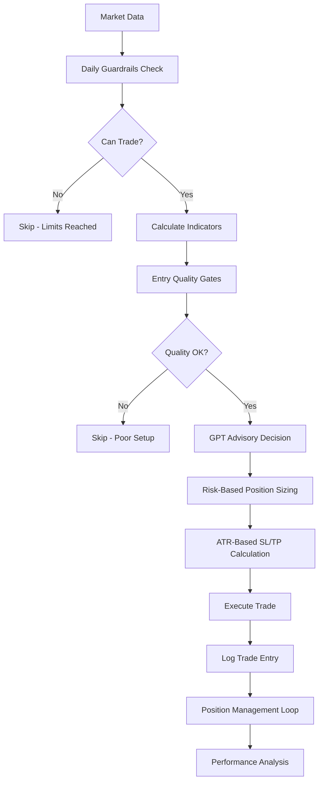

# 🚀 Enhanced Professional Trading Bot

**Complete transformation from GPT-dependent to institutional-grade algorithmic trading system**

## 📊 What's New - Professional Upgrade

### **BEFORE: Basic GPT Bot**
```
Market Data → GPT Decision → Parse Volume/SL/TP → Execute → Hope
```

### **AFTER: Professional Algorithm**
```
Market Data → Quality Gates → GPT Advisory → Risk Calc → Mechanical Execution → Trade Management → Performance Analysis
```

---

## 🎯 Core Improvements Implemented

### **1. Risk-Based Position Sizing** 
✅ **Fixed**: GPT no longer picks unrealistic volumes  
- **0.15% risk per trade** (configurable)
- Automatic pip value detection for any broker
- Volume clamped to [0.01, 0.05] until live stats justify more
- Daily risk validation prevents exceeding 1.5% drawdown

### **2. Daily Guardrails System**
✅ **Protection**: Prevents blown accounts and overtrading
- Stop after **-1.5% equity drawdown**
- Stop after **3 consecutive losses**
- Maximum **6 trades per day**
- **60-minute cooldown** after 2+ losses
- Persistent state survives bot restarts

### **3. Entry Quality Gates**
✅ **Filtering**: Only high-quality setups get through
- **Closed-bar confirmation** (no intrabar entries)
- **EMA separation threshold** (0.15×ATR minimum to avoid flat crossovers)
- **Multi-timeframe alignment** (M5 and M15 EMA trends must match)
- **Mean-reversion conflict detection** (prevents buying at upper BB, selling at lower BB)
- **Session filtering** (London/NY overlap 10:00-17:00 UTC)
- **Spread protection** (max 0.8 pips)

### **4. Mechanical Trade Management**
✅ **Professional**: No more hoping trades work out
- **ATR-based SL/TP**: 2.5×ATR SL, 2×SL TP (adjusts for RSI extremes)
- **Move to breakeven** at +1R profit
- **Partial take profit**: Close 50% at +1R
- **ATR trailing stops**: Chandelier-style with 2×ATR distance
- **Time-based exits**: Close after 15 bars (75 minutes on M5)

### **5. Comprehensive Telemetry**
✅ **Analytics**: Know exactly what's working
- **Per-trade logging**: Entry conditions, MFE/MAE, R-multiples
- **Feature capture**: EMA states, BB position, RSI, session, spread
- **Weekly reports**: Win rate, expectancy, profit factor, best conditions
- **Performance tracking**: Sharpe ratio, consecutive streaks, trade quality

---

## 🏗️ Architecture Overview

### **File Structure**
```
enhanced_system/
├── mt5_gpt_single_tweak_enhanced.py    # Main enhanced bot
├── run_enhanced_bot.py                 # Easy launcher
├── utils/
│   ├── risk_sizing.py                  # Professional position sizing
│   ├── daily_guardrails.py             # Daily risk controls
│   ├── entry_gates.py                  # Entry quality filters
│   ├── trade_manager.py                # Mechanical exits
│   ├── trade_telemetry.py              # Performance tracking
│   └── [existing utils]                # Indicators, data management, etc.
└── data/
    ├── daily_guardrails.json           # Daily state persistence
    └── telemetry/                      # Trade logs and reports
```

### **System Flow**


---

## ⚙️ Configuration

### **Core Settings** (in `mt5_gpt_single_tweak_enhanced.py`)
```python
RISK_PER_TRADE_PCT = 0.15    # 0.15% risk per trade
MAX_VOLUME = 0.05            # Conservative max until proven
MAGIC_NUMBER = 123457        # Unique trade identifier

# Daily Limits
MAX_DAILY_DRAWDOWN = 1.5     # Stop at -1.5% equity
MAX_CONSECUTIVE_LOSSES = 3   # Stop after 3 losses
MAX_DAILY_TRADES = 6         # Max 6 trades/day

# Entry Quality Thresholds
EMA_SEPARATION_FACTOR = 0.15 # Min EMA sep = 0.15×ATR
BB_CONFLICT_THRESHOLD = 0.25 # Avoid top/bottom 25% of BB
MAX_SPREAD_PIPS = 0.8        # Max spread in pips

# Trade Management
ATR_SL_MULTIPLIER = 2.5      # SL = 2.5×ATR
ATR_TP_RATIO = 2.0           # TP = 2×SL
TIME_EXIT_BARS = 15          # Exit after 15 bars
```

---

## 🚀 Quick Start

### **1. Install Requirements**
```bash
pip install -r requirements.txt
```

### **2. Set Environment Variables**
```bash
# Windows
set OPENAI_API_KEY=your_openai_api_key_here

# Linux/Mac
export OPENAI_API_KEY=your_openai_api_key_here
```

### **3. Launch Enhanced Bot**
```bash
python run_enhanced_bot.py
```

Or directly:
```bash
python mt5_gpt_single_tweak_enhanced.py
```

---

## 📊 New GPT Prompt Structure

### **What Changed**
- ❌ **Removed**: Volume, SL pips, TP pips requests
- ✅ **Added**: Mandatory reasoning requirements
- ✅ **Enhanced**: Multi-timeframe context
- ✅ **Stricter**: JSON schema enforcement

### **New GPT Response Format**
```json
{
  "action": "buy/sell/hold",
  "reasoning": "MUST explain EMA alignment, BB zone, RSI state"
}
```

### **Reasoning Requirements**
GPT must explain:
1. **EMA Alignment**: M5 vs M15 trend agreement
2. **BB Zone**: Exact Bollinger Band position
3. **RSI State**: Whether in extreme territory

If any element is missing → Trade rejected automatically.

---

## 📈 Performance Monitoring

### **Real-Time Logs**
```
✅ Guardrails passed: Daily trades OK: 2/6
✅ Entry gates approved trade
✅ TRADE EXECUTED: BUY 0.03 lots at 1.08567 (SL=1.08234, TP=1.08900)
Risk: 0.150% ($15.00), R:R = 1:2.0
📊 Position management: {'breakeven_moves': 1, 'trailing_stops': 1}
```

### **Weekly Reports**
```
📊 WEEKLY TRADING PERFORMANCE REPORT
==================================================
Total Trades: 23
Win Rate: 65.2% (15W / 8L)
Expectancy: +0.187R (+18.7 pips)
Profit Factor: 1.85
Best Trade: +2.34R
Worst Trade: -0.98R
Max Consecutive Wins: 4
Max Consecutive Losses: 2
```

### **Data Files**
- `data/daily_guardrails.json` - Daily state tracking
- `data/telemetry/trades/trade_metrics.jsonl` - Complete trade history
- `data/telemetry/reports/` - Weekly performance reports

---

## 🔧 Key Differences from Original

| Feature | Original Bot | Enhanced Bot |
|---------|-------------|--------------|
| **Position Sizing** | GPT picks volume | Risk-based calculation (0.15%) |
| **Entry Filters** | None | 6 quality gates |
| **Daily Limits** | None | Drawdown, loss, trade count limits |
| **Exit Management** | Static SL/TP | ATR-based + breakeven + trailing |
| **Performance Tracking** | Basic logs | Comprehensive R-multiple analysis |
| **Multi-timeframe** | Basic M15 check | Strict M5/M15 alignment required |
| **Mean Reversion** | None | BB conflict detection |
| **Session Filtering** | None | London/NY overlap only |
| **Spread Protection** | None | Max 0.8 pip threshold |
| **Time Exits** | None | 15-bar maximum hold |

---

## ⚠️ Important Notes

### **Testing Recommendations**
1. **Demo First**: Always test on demo account
2. **Small Size**: Start with minimum risk (0.10%)
3. **Monitor Closely**: Watch first 10-20 trades
4. **Adjust Gradually**: Increase risk only after proven performance

### **Risk Warnings**
- **Past performance doesn't guarantee future results**
- **Forex trading involves substantial risk of loss**
- **Only trade with capital you can afford to lose**
- **The enhanced system reduces but doesn't eliminate risk**

### **System Dependencies**
- **MT5 Terminal**: Must be running and connected
- **OpenAI API**: Valid API key with sufficient credits
- **Stable Internet**: Reliable connection required
- **Python 3.8+**: Required for all dependencies

---

## 🛠️ Troubleshooting

### **Common Issues**

**Bot won't start:**
- Check MT5 terminal is running
- Verify OPENAI_API_KEY is set
- Ensure EURUSD symbol is available

**No trades executing:**
- Check daily guardrails status
- Verify session time (10:00-17:00 UTC)
- Review entry gate logs

**High spread errors:**
- Normal during news events
- Bot will wait for spreads to normalize
- Adjust MAX_SPREAD_PIPS if needed

### **Monitoring Commands**
```bash
# Check recent logs
tail -f logs/trading_bot_enhanced.log

# View daily status
python -c "from utils.daily_guardrails import DailyGuardrails; print(DailyGuardrails().get_daily_stats())"

# Generate report
python -c "from utils.trade_telemetry import TradeTelemetry; print(TradeTelemetry().generate_weekly_report())"
```

---

## 📞 Support & Development

### **Customization Options**
- Risk percentage per trade
- Daily limit thresholds  
- Entry gate strictness
- ATR multipliers
- Time exit periods

### **Future Enhancements**
- Machine learning integration
- Multi-asset portfolio mode
- Advanced market regime detection
- Dynamic parameter optimization

---

**🎯 Summary: Trade fewer, better setups with professional risk management, mechanical exits, and comprehensive performance tracking.**

*Enhanced Trading Bot v3.0 - Institutional Grade Risk Management*
